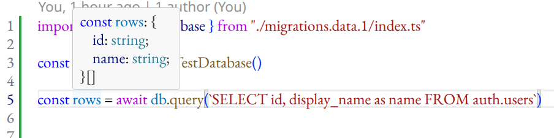
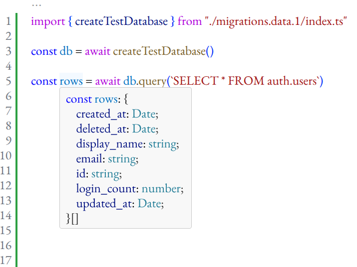
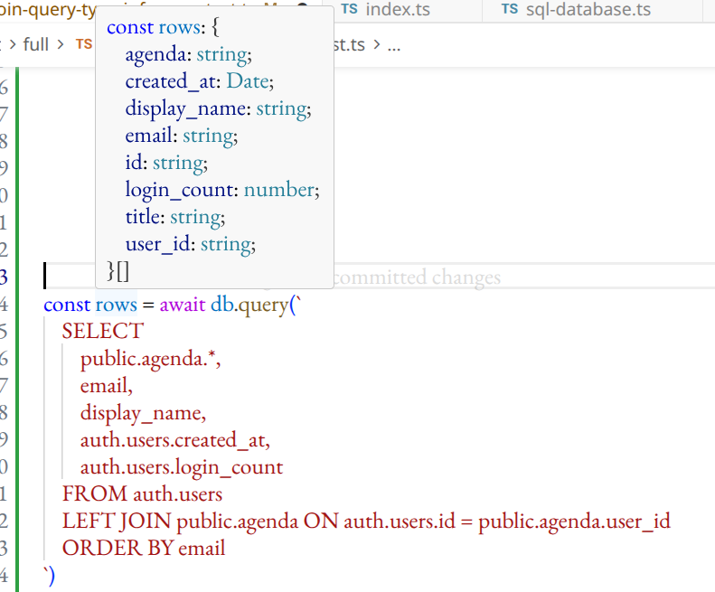
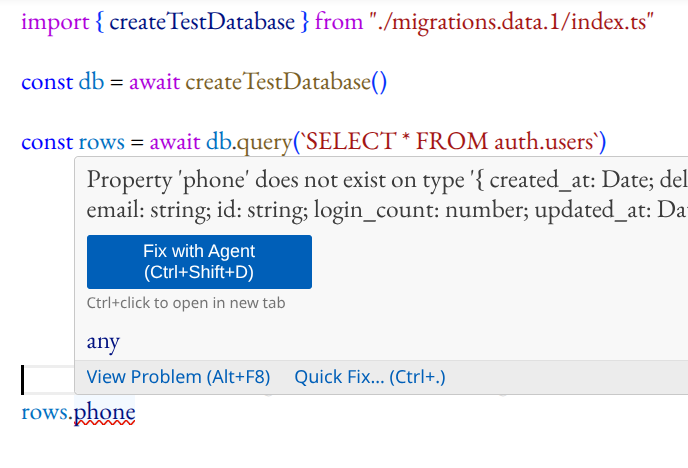

# dbtyper: TypeScript for SQL — a Compile-Time SQL Type Checker

> _Write plain SQL. Get fully typed rows. No ORM. No query builder DSL. No N+1 footguns._

---

## The SQL hole in your TypeScript codebase

TypeScript is great at catching errors early. Rename a field, change a type, delete a property — the compiler tells you immediately, everywhere it matters. Refactoring is fast, feedback is instant, and the codebase stays coherent as it grows.

Then there's SQL.

SQL queries are plain strings. You know the pain — you remember it from the pre-TypeScript days, when your functions were bloated with input parameter checks right at the top. So now you rename a column in a table and instead of fixing red underlines in seconds, you run tests for minutes. If you have them.

The natural response is ORMs and query builders. That adds layers of abstraction on top of abstractions built to hide other abstractions. We've brought a dozen typed ORMs with different sets of supported SQL features just to get that quick feedback from TypeScript — and instead we've cognitively overwhelmed ourselves and our LLMs, which still prefer to write plain SQL even in a NestJS project, because even soulless AI prefers readability and simplicity. Loop closed.

Let me say it again. **LLMs already know SQL extremely well.** Every model has been trained on millions of SQL examples. When you ask an LLM to write SQL, it just writes SQL — correctly, concisely, in a form every developer on the team can read without translation. The price of this approach is unmaintainable code. If you're lucky you also have a ton of tests. And AI bills to pay, because all that code — the features, the tests, everything — is not free — it costs tokens and grabs context.

What we need is TypeScript for SQL. Typed SQL string literals that know your schema and turn every query into a type-checked statement — so that schema changes propagate as type errors, instantly, without running anything.

That's `dbtyper` — a compile-time SQL parser written using the TypeScript type system.

---

## Enter dbtyper

`dbtyper` is a TypeScript library that parses your SQL string literals at the **type level** and returns a properly typed array of rows — no codegen, no build step, no DSL to learn.

```typescript
const rows = await db.query(`
    SELECT id, name, email FROM users
`)
// rows: Array<{ id: number; name: string; email: string }>
```

```typescript
const rows = await db.query(`SELECT * FROM users`)
// rows: Array<{ id: number; name: string; email: string; phone: string; created_at: Date }>
```

The types come from your schema, which is declared once through your migration chain. The SQL string is the source of truth for which columns appear in the result.

---

## Setup

### 1. Define your database through migrations

```typescript
// db/index.ts
import { sqlMigrations } from "dbtyper"
import type { PostgresDriver } from "dbtyper/postgres"

export async function exampleDb(driver: PostgresDriver) {
	return sqlMigrations({ driver })
		.apply((await import("../migrations/001.do.schemas.js")).generateSql())
		.apply((await import("../migrations/002.do.users.js")).generateSql())
		.apply((await import("../migrations/003.do.agenda.js")).generateSql())
		.apply((await import("../migrations/004.do.seed_users.js")).generateSql())
		.database()
}
```

Each migration contributes to the accumulated type-level schema. By the end of the chain, the library knows the shape of every table.

### 2. Connect and query

```typescript
import postgres from "postgres"
import { postgresSqlDriver } from "dbtyper/postgres"
import { exampleDb } from "./db/index.js"

const db = await exampleDb(postgresSqlDriver({ sql: postgres(connectionString, { max: 10 }) }))

const rows = await db.query(`
    SELECT
        public.agenda.*,
        email,
        display_name,
        auth.users.created_at,
        auth.users.login_count
    FROM auth.users
    LEFT JOIN public.agenda
        ON auth.users.id = public.agenda.user_id
    ORDER BY email
`)
```

---

## What the IDE sees

### Simple SELECT with named columns

```typescript
const rows = await db.query(`SELECT id, name FROM users`)
```



Hover over `rows` in your IDE and the inferred type is available immediately:

```
const rows: Array<{
    id: number;
    name: string;
}>
```

_The type tooltip appears inline — no annotation, no manual generic._

---

### SELECT \* expands to the full table shape

```typescript
const rows = await db.query(`SELECT * FROM users`)
```



Hover over `rows` and `SELECT *` expands to the known table shape:

```
const rows: Array<{
    id: number;
    name: string;
    email: string;
    phone: string;
    created_at: Date;
    login_count: number;
}>
```

---

### JOIN across schemas — types merge correctly

```typescript
const rows = await db.query(`
    SELECT
        public.agenda.*,
        email,
        display_name,
        auth.users.created_at,
        auth.users.login_count
    FROM auth.users
    LEFT JOIN public.agenda ON auth.users.id = public.agenda.user_id
    ORDER BY email
`)
```



Hover over `rows` and the joined result type is merged from both tables:

```
const row: {
    agenda: string;
    created_at: Date;
    display_name: string;
    email: string;
    id: string;
    login_count: number;
    title: string;
    user_id: string;
}
```

---

### Schema change = instant compile error

Rename a column in your migration (`phone` → `phone_number`), and every `query()` call that references `phone` becomes a type error — immediately, without running anything.



After a column rename, TypeScript reports the stale property access:

```
Property 'phone' does not exist on type '{ id: number; name: string; phone_number: string; ... }'
```

---

### Params are supported

```typescript
const rows = await db.query(`SELECT * FROM users WHERE id = :id AND active = :active`, { id: 42, active: true })
```

---

## The full API

```typescript
export type DataBase<Db> = {
	// Typed query — statement parsed at type level
	query<Stmt extends string>(statement: Stmt): Promise<Array<SqlSelectRowObject<Db, Stmt>>>
	query<Stmt extends string, Params extends ExpressionParamsShape>(
		statement: Stmt,
		params: ParamRuntimeValues<Params>,
	): Promise<Array<SqlSelectRowObject<Db, Stmt, Params>>>

	// Escape hatch for unsupported features or gradual migration
	queryUntyped(statement: string, params?: Record<string, unknown>): Promise<Array<any>>

	// Streaming — same type inference, async iterable
	stream<Stmt extends string>(statement: Stmt): AsyncIterable<SqlSelectRowObject<Db, Stmt>>
	stream<Stmt extends string, Params extends ExpressionParamsShape>(
		statement: Stmt,
		params: ParamRuntimeValues<Params>,
	): AsyncIterable<SqlSelectRowObject<Db, Stmt, Params>>

	streamUntyped(statement: string, params?: Record<string, unknown>): AsyncIterable<any>
}
```

`queryUntyped` / `streamUntyped` exist for two reasons: gradual codebase migration, and SQL features the parser doesn't support yet (more on that below).

---

## Current limitations (and why they don't block you)

`dbtyper` is under active development. The type-level SQL parser currently handles:

✅ `SELECT col1, col2 as col3` — named columns and aliases
✅ `SELECT *` or `SELECT table.*` — full table expansion  
✅ `LEFT JOIN`, `INNER JOIN`, cross-schema joins  
✅ SQL parameters — validated at compile time  
✅ `ORDER BY`, `LIMIT`, `OFFSET`  
✅ Multi-schema databases (`auth.users`, `public.sales`)  
✅ Streaming results  
✅ Computed expressions with operators (`price * quantity AS total`, `a + b AS sum`)

✅ Accessing a column that doesn't exist in the query result — compile-time error

🚧 Not yet supported:

- `GROUP BY` / `HAVING`
- Built-in SQL functions — partial support only
- User-defined functions
- User-defined types — enums are surfaced as `string`
- Nested subqueries
- Better compile-time diagnostics when the SQL string itself is malformed — planned

For anything in the 🚧 list, `queryUntyped` is your bridge. You don't have to delay adopting the library — use typed queries where you can, untyped where you can't, and migrate as the parser grows.

---

## Why this matters more than "nicer types"

### 1. The abstraction stack collapses

With a type-safe raw SQL primitive, you don't need the query builder that generates it, the ORM that wraps the builder, or the repository that wraps the ORM. One layer. One concept.

```typescript
// Instead of this (4 layers, N+1 risk):
const users = await userRepository.findAll({ include: ["orders"] })

// Just write the JOIN:
const rows = await db.query(`
    SELECT u.id, u.name, o.total
    FROM users u
    JOIN orders o ON u.id = o.user_id
`)
// rows: Array<{ id: number; name: string; total: number }>
```

### 2. Schema changes propagate instantly

The DB boundary is normally a black hole for TypeScript's type system. Migrations run, columns change, and your code only finds out at runtime. With `dbtyper`, the schema lives in the type system. A migration is a type-level event.

### 3. LLMs write better code with this

SQL is universal. Every model has seen way more SQL examples than ORM ones.

With `dbtyper`:

- The model writes plain SQL — shorter, clearer, more reliable
- The type checker catches errors in the same edit cycle — no DB roundtrip needed
- Schema changes are immediately visible as type errors — the model can fix them without running anything

The feedback loop collapses from _write → run tests or deploy & run → crash → reason_ to _write → type error → fix_.

---

## Interested? More:

- [NestJS integration example](https://github.com/vadzim/dbtyper/tree/main/examples/nest-postgres)
- [Plain postgres integration example](https://github.com/vadzim/dbtyper/tree/main/examples/typed-postgres)

## Is it production ready?

Not at all. It's still alpha.

---

_SQL already was the right abstraction. It just needed types._
